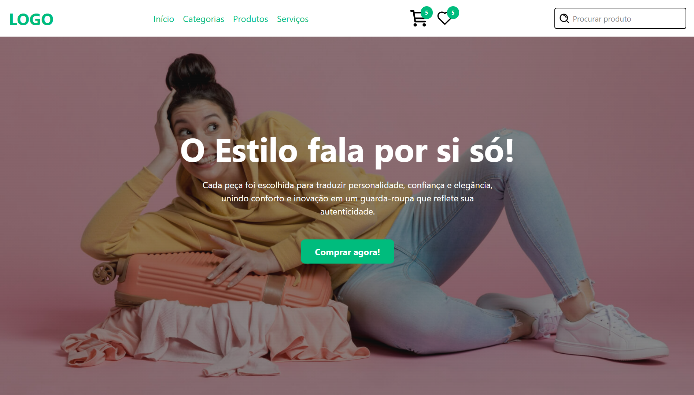
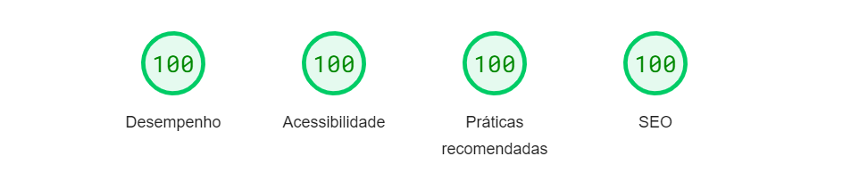

<h3 align="center">Clothecommerce - Ecommerce de roupas | Concluído :white_check_mark:</h3>

---

## Sobre o projeto :computer:

Um pequeno Ecommerce de roupas desenvolvido apenas no Frontend, com funcionalidades mínimas como interação com 
o botão de favoritos, carregar mais produtos e página para cada produto. A diferença para esse Ecommerce é: possui 100% de
desempenho. No final deste README há uma imagem mostrando o desempenho da aplicação.

---

## Tecnologias usadas :star:

- [x] NextJS
- [x] ReactJS
- [x] Tailwind CSS
- [x] TypeScript

---

  
  
  
  

---

## Demo :camera:

---

## Desempenho :mag:

---

## Autor :raising_hand:

<b>Henry Nicollas Issicaba Neves</b>

  

